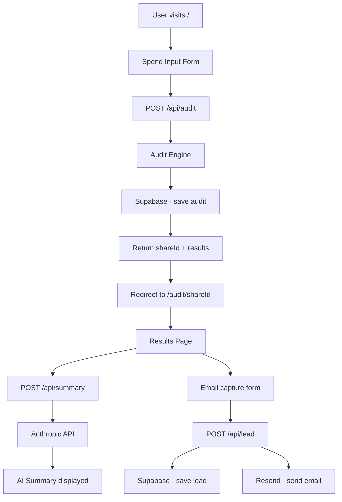

# Architecture

## System Diagram

## Data Flow

1. User fills spend input form with tools, plans, seats, monthly spend
2. Form POSTs to `/api/audit` with full FormData
3. Audit engine runs deterministic rules against each tool
4. Result saved to Supabase with a unique shareId (nanoid)
5. User redirected to `/audit/[shareId]`
6. Results page fetches AI summary from `/api/summary`
7. Anthropic API generates personalized 100-word summary
8. If API fails, templated fallback summary is shown
9. User optionally submits email → saved to Supabase + confirmation email via Resend

## Stack

- **Frontend**: Next.js 16 (App Router) + TypeScript + Tailwind CSS
- **Backend**: Next.js API Routes (serverless)
- **Database**: Supabase (Postgres)
- **Email**: Resend
- **AI**: Anthropic Claude API with fallback
- **Deployment**: Vercel
- **CI**: GitHub Actions

## Why This Stack

- **Next.js**: Full-stack in one repo, serverless API routes, easy Vercel deploy
- **TypeScript**: Catches bugs at compile time, especially important for audit logic
- **Supabase**: Postgres with a great free tier, instant REST API, no server to manage
- **Resend**: Best DX for transactional email, generous free tier
- **Tailwind**: Fast styling without context switching

## What I'd Change at 10k Audits/Day

- Add Redis caching for audit results (avoid recomputing same inputs)
- Move audit engine to a dedicated worker (separate from Next.js)
- Add a CDN layer for the results page (mostly static after generation)
- Switch Supabase free tier to dedicated Postgres instance
- Add rate limiting per IP on `/api/audit`
- Add a job queue for email sending instead of inline await